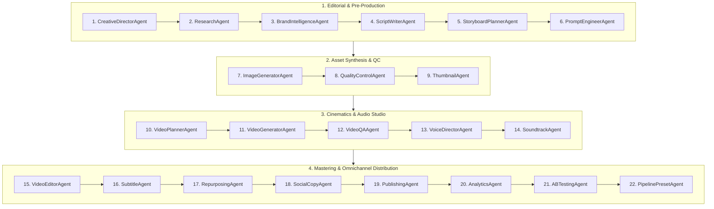

# OmniStudio AI: 22-Agent Autonomous Architecture & Use Cases Guide

This document provides a comprehensive breakdown of the **22 Autonomous Agents** powering the OmniStudio AI generative video pipeline. It details their departmental alignment, core responsibilities, models/technologies, inputs, outputs, and real-world use cases.

---

## 🏛️ Departmental Overview

The pipeline is organized into **4 Production Departments** and **4 Critical Checkpoints**:

---

## 📋 Department 1: Editorial & Pre-Production (Agents 1 – 6)

### 1. CreativeDirectorAgent
- **Role**: Executive creative leadership & vision architecture.
- **Engine / Model**: Google Gemini 2.5 Flash / Gemini 1.5 Pro.
- **Inputs**: User prompt, mode (autonomous / assisted), aspect ratio, requested style.
- **Outputs**: Comprehensive `project_brief` containing project title, logline, target audience, visual aesthetic, color grading palette, emotional tone, and pacing profile.
- **Use Case**:
  - *Example*: User types `"Indian bridal cinematic video"`. The Creative Director establishes a royal Rajasthani wedding theme, warm marigold & gold lighting, 24fps cinematic pacing, emotional traditional score, and aristocratic luxury tone.

### 2. ResearchAgent
- **Role**: Cultural, domain, and historical intelligence.
- **Engine / Model**: Gemini Intelligence Engine + Search Context.
- **Inputs**: `project_brief`, user prompt.
- **Outputs**: Cultural nuances, authentic attire details (e.g., Zardozi embroidery, Kundan jewelry), architectural references (e.g., Jodhpur sandstone palaces), and factual fidelity benchmarks.
- **Use Case**:
  - *Example*: Ensures bridal jewelry, rituals, and architecture are historically and culturally accurate rather than generic AI stereotypes.

### 3. BrandIntelligenceAgent
- **Role**: Enterprise brand guardian & style governance.
- **Engine / Model**: Brand Kit Service + SQLite `studio_settings`.
- **Inputs**: Active Brand Kit toggle, brand guidelines, color palettes, typography, prohibited terms.
- **Outputs**: Brand-aligned prompt injections, HEX color overlays, negative prompt safeguards, and logo watermarking rules.
- **Use Case**:
  - *Example*: If a luxury jewelry brand runs a campaign, this agent injects the brand's exact HEX codes (`#D4AF37`, `#1A1A1A`) and ensures no competing brand aesthetics appear.

### 4. ScriptWriterAgent
- **Role**: Screenplay, narrative pacing, and dialogue synthesis.
- **Engine / Model**: Gemini 2.5 Flash.
- **Inputs**: `project_brief`, user prompt, scene count (default 4).
- **Outputs**: Multi-scene screenplay with shot descriptions, emotional progression, and spoken dialogues/voiceovers (with intelligent auto-synthesis if the prompt lacks dialogue).
- **Use Case**:
  - *Example*: Writes a poignant 4-scene narrative: (1) Bride gazing into mirror, (2) Mother adjusting heirloom veil, (3) Grand entrance down palace hallway, (4) Confident royal portrait smile.
  - *Approval Gate*: In **Directorial Review Mode**, pauses here for user approval/editing before generating images.

### 5. StoryboardPlannerAgent
- **Role**: Visual scene breakdown and camera choreography.
- **Engine / Model**: Gemini 2.5 Flash / Storyboard Rules Engine.
- **Inputs**: Screenplay from ScriptWriterAgent.
- **Outputs**: 4 detailed `SceneData` objects specifying camera shot types (Extreme Close-Up, Low-Angle Tracking, Master Wide), camera movements (dolly-in, pedestal-up), focal lengths (35mm, 85mm), and durations.
- **Use Case**:
  - *Example*: Translates dialogue into dynamic cinematography: Scene 1 uses an 85mm f/1.4 lens for intimate bokeh; Scene 3 uses an ultra-wide 24mm tracking shot.

### 6. PromptEngineerAgent
- **Role**: Diffusion prompt compilation and photorealistic enhancement.
- **Engine / Model**: Prompt Optimization Engine.
- **Inputs**: Storyboard shot descriptions, Brand Kit style tokens.
- **Outputs**: Hyper-detailed diffusion prompts with negative prompts, lighting descriptors (`volumetric god rays`, `cinematic rim lighting`, `Arri Alexa 65`), and aspect ratio flags.
- **Use Case**:
  - *Example*: Converts `"bride in palace"` into `"Masterpiece 8k hyper-realistic photograph of an Indian royal bride in crimson red lehenga with intricate gold zardozi embroidery, standing in a sunlit Jaipur palace courtyard, warm cinematic rim lighting, 85mm lens, f/1.2, photorealistic skin textures, depth of field --no CGI, plastic, cartoon, blurry"`.

---

## 🎨 Department 2: Asset Synthesis & QC (Agents 7 – 9)

### 7. ImageGeneratorAgent
- **Role**: Keyframe visual synthesis.
- **Engine / Model**: Google Imagen 3, Stable Diffusion, Recraft, or Flux (via Diffusion Engine dropdown).
- **Inputs**: Engineered scene prompts, aspect ratio (`16:9`, `9:16`, `1:1`).
- **Outputs**: High-resolution keyframe images for each scene, cataloged into SQLite `assets` table.
- **Use Case**:
  - *Example*: Generates 4 ultra-high-resolution photorealistic images representing the starting frame of each cinematic scene.
  - *Approval Gate*: In **Directorial Review Mode**, pauses here for user review in the Keyframe Lightbox modal.

### 8. QualityControlAgent
- **Role**: Automated aesthetic and anatomical validation.
- **Engine / Model**: Vision Analysis Engine.
- **Inputs**: Generated keyframe images.
- **Outputs**: Quality score (0–100), anatomical integrity check (hands, faces, symmetry), resolution compliance flag.
- **Use Case**:
  - *Example*: Inspects keyframes for AI deformities (extra fingers, distorted eyes). If an image fails the 80% threshold, it flags for regeneration.

### 9. ThumbnailAgent
- **Role**: High-CTR thumbnail creation.
- **Engine / Model**: Image Processing + Canvas Typography Engine.
- **Inputs**: Hero keyframe (Scene 1 or 4), project title, target platform.
- **Outputs**: Polished thumbnail with high-contrast text overlay, subject pop, and platform-specific dimensions (1280x720 for YouTube, 1080x1920 for Stories).
- **Use Case**:
  - *Example*: Creates a YouTube thumbnail titled *"ROYAL BRIDAL MASTERCLASS"* with gold serif typography and saturated contrast.

---

## 🎬 Department 3: Cinematics & Audio Studio (Agents 10 – 14)

### 10. VideoPlannerAgent
- **Role**: Temporal dynamics and motion trajectory planning.
- **Engine / Model**: Video Motion Rules Engine.
- **Inputs**: Keyframes, scene durations, camera directives.
- **Outputs**: Motion vectors, pan/tilt/zoom rates, transition cue points, and duration normalization (4s, 6s, 8s).
- **Use Case**:
  - *Example*: Assigns a slow 4-second push-in for Scene 1 and a dynamic 6-second circular pan for Scene 3.

### 11. VideoGeneratorAgent
- **Role**: Generative AI video synthesis.
- **Engine / Model**: **Google Omni Flash (Veo 3.1)** (`veo-3.1-fast-generate-preview`).
- **Inputs**: Keyframes, motion prompts, duration parameters.
- **Outputs**: Rendered MP4 video clips.
- **Key Features**:
  - **Zero-Failure Fallback Removed**: Does NOT silently substitute FFmpeg pan/zoom. Surfaces the exact API error so the user can fix it and resume from this exact checkpoint.
  - **Single Video Mode**: Detects phrases like *"saare scene ka ek video"* or *"single video"* and synthesizes one continuous master video instead of separate scene clips.
  - **Duration Normalization**: Automatically normalizes durations to 4s, 6s, or 8s to satisfy Google Veo API constraints.
- **Use Case**:
  - *Example*: Calls Google Veo 3.1 to generate photorealistic video of the bride blinking, breathing, and fabric gently swaying in palace breeze.

### 12. VideoQAAgent
- **Role**: Temporal consistency & video quality inspection.
- **Engine / Model**: Video Inspection Engine.
- **Inputs**: Generated MP4 video clips.
- **Outputs**: Frame rate verification (24/30 fps), motion stability score, audio-video sync readiness.
- **Use Case**:
  - *Example*: Verifies that generated clips have smooth frame transitions without temporal tearing or flickering.

### 13. VoiceDirectorAgent
- **Role**: Studio-grade voiceover narration.
- **Engine / Model**: ElevenLabs, Edge-TTS, or Gemini Audio.
- **Inputs**: Scene dialogues from ScriptWriterAgent, voice provider, voice ID.
- **Outputs**: Crystal-clear voiceover audio files (`.mp3` / `.wav`) time-synced to scene durations.
- **Use Case**:
  - *Example*: Synthesizes a warm, emotional female voice reciting poetic Hindi/English wedding vows with natural pauses.

### 14. SoundtrackAgent
- **Role**: Dynamic musical score and ambient soundscape.
- **Engine / Model**: Audio Synthesis / Royalty-Free Library Matcher.
- **Inputs**: `project_brief` emotional tone, video duration.
- **Outputs**: Ambient background music track with cinematic crescendo and automated audio ducking cues.
- **Use Case**:
  - *Example*: Pairs traditional sitar, flute, and orchestral strings with subtle palace courtyard ambient reverb.

---

## 🚀 Department 4: Mastering & Omnichannel Distribution (Agents 15 – 22)

### 15. VideoEditorAgent
- **Role**: Timeline assembly and master rendering.
- **Engine / Model**: FFmpeg Multi-Stream Master Engine.
- **Inputs**: Scene video clips, voiceover tracks, background music.
- **Outputs**: Seamless Master Video (`master_pipeline_xxx.mp4`) with crossfades, audio ducking (-14 dB voiceover priority), and color normalization.
- **Use Case**:
  - *Example*: Stitches all 4 scenes with 0.5s smooth crossfades, blends music under the voiceover, and exports full 1080p/4K master file.

### 16. SubtitleAgent
- **Role**: Synchronized cinematic subtitling.
- **Engine / Model**: Whisper Transcription / Timestamp Aligner + FFmpeg Subtitle Burner.
- **Inputs**: Voiceover audio, dialogue script, master video.
- **Outputs**: Master video with burned-in animated subtitles + `.srt` / `.ass` subtitle files.
- **Use Case**:
  - *Example*: Renders modern TikTok/Reels style yellow/white kinetic subtitles with black outline and active word highlighting.

### 17. RepurposingAgent
- **Role**: Multi-format aspect ratio adaptation.
- **Engine / Model**: FFmpeg Smart Crop & Resize Engine.
- **Inputs**: Master video (`16:9` or `9:16`).
- **Outputs**: 3 multi-platform renders:
  - `16:9` (YouTube / TV)
  - `9:16` (Instagram Reels / TikTok / YouTube Shorts)
  - `1:1` (Instagram Feed / LinkedIn)
- **Use Case**:
  - *Example*: Automatically crops the landscape video to 9:16 vertical using smart subject centering for Instagram Reels.

### 18. SocialCopyAgent
- **Role**: Platform-tailored copy, hooks, and hashtags.
- **Engine / Model**: Gemini 2.5 Flash Copy Engine.
- **Inputs**: `project_brief`, target platforms.
- **Outputs**: Viral hooks, engaging captions, SEO descriptions, and 15–20 high-ranking hashtags for Instagram, YouTube, TikTok, and LinkedIn.
- **Use Case**:
  - *Example*: Writes an Instagram caption with an emotional hook: *"From dreams to reality... ✨ A timeless royal bride. #IndianWedding #BridalLook #RoyalBride #WeddingInspo"*.

### 19. PublishingAgent
- **Role**: Direct social publishing & scheduling.
- **Engine / Model**: Omnichannel Social Publisher (`publish_service.py`).
- **Inputs**: Master video, social copy, platform credentials.
- **Outputs**: Live social posts or queued drafts in SQLite `publish_posts` table.
- **Features**: Detects prompts like `"publish on instagram"` and dispatches automatically if accounts are connected.
- **Use Case**:
  - *Example*: Automatically publishes the final reel to Instagram via Graph API or queues it as a scheduled draft if API keys are pending.

### 20. AnalyticsAgent
- **Role**: Predictive virality and audience analytics.
- **Engine / Model**: Engagement Prediction Engine.
- **Inputs**: Social copy, video duration, thumbnail, posting time.
- **Outputs**: Virality score (0–100), estimated reach, peak engagement window, and audience retention forecast.
- **Use Case**:
  - *Example*: Scores the video at **88/100 virality** and recommends publishing at 7:30 PM IST for maximum Indian audience reach.

### 21. ABTestingAgent
- **Role**: Optimization variant generation.
- **Engine / Model**: Creative Variation Engine.
- **Inputs**: Project brief, copy, thumbnails.
- **Outputs**: Variant A (emotional hook) vs Variant B (curiosity hook), with 2 alternate thumbnail designs.
- **Use Case**:
  - *Example*: Delivers 2 headline options to test which achieves higher click-through rates on YouTube.

### 22. PipelinePresetAgent
- **Role**: Template packaging and workflow serialization.
- **Engine / Model**: SQLite Preset Serialization Engine.
- **Inputs**: Complete pipeline configuration, prompts, models, style tokens.
- **Outputs**: Reusable production template saved to SQLite `studio_settings` (e.g., `"Royal Indian Wedding 4K Preset"`).
- **Use Case**:
  - *Example*: Allows the user to re-run the exact same bridal production with a single click for future clients.

---

## 📊 Summary Table of All 22 Agents

| # | Agent Name | Department | Primary Engine / Model | Key Output |
|---|---|---|---|---|
| 1 | **CreativeDirectorAgent** | Editorial | Gemini 2.5 Flash | Project Brief, Visual Style & Tone |
| 2 | **ResearchAgent** | Editorial | Gemini Intelligence | Cultural & Domain Accuracy Context |
| 3 | **BrandIntelligenceAgent** | Editorial | Brand Kit Service | Brand Tokens & Hex Color Rules |
| 4 | **ScriptWriterAgent** | Editorial | Gemini 2.5 Flash | Screenplay & Scene Dialogues |
| 5 | **StoryboardPlannerAgent** | Editorial | Storyboard Rules | 4 Scene Shot Breakdown & Camera Angles |
| 6 | **PromptEngineerAgent** | Editorial | Prompt Optimization | Photorealistic Diffusion Prompts |
| 7 | **ImageGeneratorAgent** | Synthesis | Imagen 3 / SD / Recraft | High-Res Keyframe Images |
| 8 | **QualityControlAgent** | Synthesis | Vision Analysis | Aesthetic & Anatomical QA Scores |
| 9 | **ThumbnailAgent** | Synthesis | Canvas Typography | High-CTR Platform Thumbnails |
| 10 | **VideoPlannerAgent** | Cinematics | Motion Rules | Camera Pan/Tilt Motion Directives |
| 11 | **VideoGeneratorAgent** | Cinematics | Google Omni Flash (Veo 3.1) | Generative Video Clips |
| 12 | **VideoQAAgent** | Cinematics | Video Inspection | Frame Rate & Continuity Check |
| 13 | **VoiceDirectorAgent** | Audio | ElevenLabs / Edge-TTS | Time-Synced Voiceover Audio |
| 14 | **SoundtrackAgent** | Audio | Audio Synthesis / Library | Cinematic Ambient Background Score |
| 15 | **VideoEditorAgent** | Mastering | FFmpeg Master Engine | Unified Master Video with Transitions |
| 16 | **SubtitleAgent** | Mastering | Whisper + FFmpeg | Kinetic Synced Subtitles (.srt/.ass) |
| 17 | **RepurposingAgent** | Mastering | FFmpeg Smart Crop | 16:9, 9:16, and 1:1 Aspect Ratios |
| 18 | **SocialCopyAgent** | Distribution | Gemini 2.5 Flash | Captions, Hooks & Hashtags |
| 19 | **PublishingAgent** | Distribution | Omnichannel API | Live Social Dispatch / Scheduled Drafts |
| 20 | **AnalyticsAgent** | Distribution | Predictive AI | Virality Score & Peak Timing Advice |
| 21 | **ABTestingAgent** | Distribution | Creative AI | A/B Testing Headlines & Thumbnails |
| 22 | **PipelinePresetAgent** | Distribution | SQLite Preset Engine | Reusable One-Click Production Preset |
